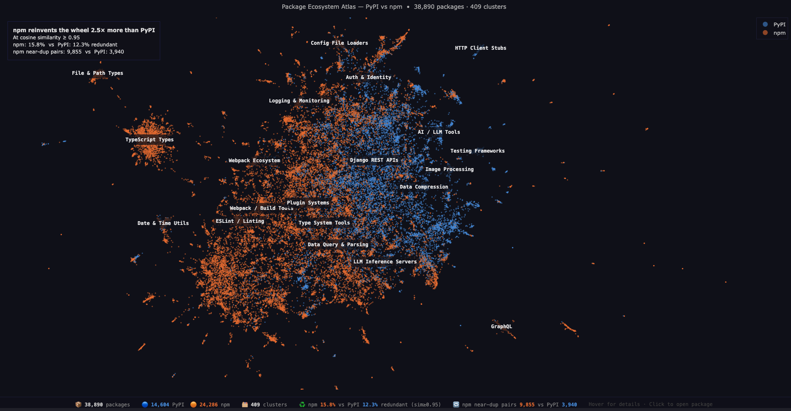

# Package Ecosystem Atlas

**npm reinvents the wheel 2.5× more than PyPI** — measured across 38,890 packages using embedding-based redundancy detection.

🗺️ **[Explore the live atlas →](https://Swapnil99007.github.io/package-atlas/)**



---

## The Finding

| Metric | PyPI | npm | npm vs PyPI |
|---|---|---|---|
| Packages with a near-duplicate (sim ≥ 0.95) | 12.3% | **15.8%** | +3.5 pp |
| Near-duplicate description pairs | 3,940 | **9,855** | **2.5×** |
| Perfect duplicates (sim ≥ 0.9999) | 832 | **1,957** | 2.4× |
| Mean nearest-neighbour similarity | 0.862 | **0.876** | higher = more crowded |

The gap is consistent across every threshold tested (0.90 → 0.99). npm's redundancy is driven by its scoped-fork culture — `@babel/plugin-*` / `babel-plugin-*`, `@vercel/sqs-consumer` / `sqs-consumer`, and monorepo packages sharing boilerplate descriptions like `"mono repo setup with bob"`.

---

## Atlas features

- **38,890 packages** (top 15k PyPI + top 25k npm by monthly downloads)
- **409 semantic clusters** found by HDBSCAN on embedding space
- **Region labels** — 21 named topic areas: AI / LLM Tools, Testing Frameworks, GraphQL, Django REST APIs…
- **Hover** any dot → full description + monthly downloads + link
- **Click** any dot → opens the package on PyPI or npm

---

## Methodology

```
01_fetch/    → Async-fetch top packages with descriptions + download counts
02_clean/    → Drop null / single-word / placeholder / non-English descriptions
03_embed/    → BAAI/bge-small-en-v1.5 (33M params) on Apple Silicon MPS — 56 seconds
04_reduce/   → UMAP 384D→2D (n_neighbors=15, min_dist=0.05, seed=42)
               HDBSCAN (min_cluster_size=20) → 409 clusters
05_metrics/  → Chunked cosine similarity (L2-normalised dot product)
               Per-ecosystem redundancy rates at 5 thresholds
06_visualize/→ Plotly Scattergl (WebGL) → self-contained HTML on GitHub Pages
```

**Why bge-small over larger models**: Qwen3-Embedding-0.6B (decoder-only) does not accelerate on Apple MPS — 26-hour projected runtime vs 56 seconds for the encoder-only bge-small. For within-corpus description similarity the quality difference is negligible.

**Why within-ecosystem, not between**: Comparing PyPI vs npm embeddings directly just produces two blobs separated by vocabulary ("Python" vs "JavaScript"). The interesting signal is *within* each ecosystem — how many packages are describing the same thing as another package in the same registry.

---

## Reproduce

```bash
# 1. Install deps
python -m venv .venv && source .venv/bin/activate
pip install -r requirements.txt

# 2. Run the full pipeline (~30 min first run, mostly fetch + embed)
python run_pipeline.py

# 3. Open the atlas
open docs/index.html
```

**Requirements**: Python 3.11+, Apple Silicon recommended for stage 03 (CPU fallback works, ~3 hrs).

---

## Stack

| Stage | Tool |
|---|---|
| Async HTTP | `httpx[asyncio]` |
| Data | `pandas`, `pyarrow` (Parquet) |
| Embeddings | `sentence-transformers` + `BAAI/bge-small-en-v1.5` |
| Reduction | `umap-learn` |
| Clustering | `hdbscan` |
| Similarity | `numpy` (chunked dot product) |
| Visualization | `plotly` (Scattergl / WebGL) |
| Hosting | GitHub Pages |

---

## Data sources

- **PyPI**: [hugovk/top-pypi-packages](https://github.com/hugovk/top-pypi-packages) (top 15k) + `pypi.org/pypi/{name}/json`
- **npm**: [evanwashere/top-npm-packages](https://github.com/evanwashere/top-npm-packages) (top 25k) + `registry.npmjs.org/{name}/latest`
